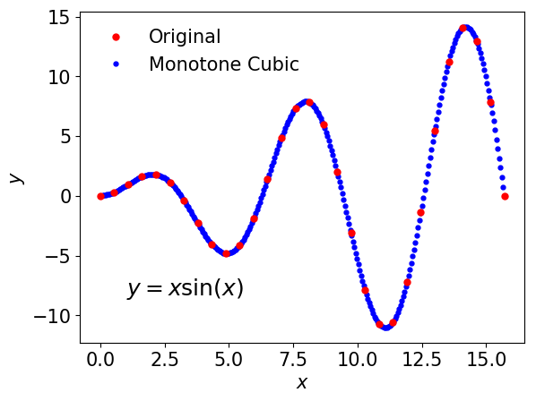

Monotone Cubic Interpolation
============================================================

Implementation for **monotone cubic interpolation** with the Hermite function through python3 and C++

Environment Setup
--------------

+ python3
  + numpy
  + matplotlib (optional)
+ C++
  + Standard c++11 or higher version is required.

Example
--------------

  
+ Figure for the results via monotone cubic interpolation
  + \# of original data points : 30
  +    **""** for interpolation : 500

Reference
--------------
F. N. Fritsch and R. E. Carlson, *Monotone Piecewise Cubic Interpolation*, SIAM. **17**, 2 (1980). [Link](https://epubs.siam.org/doi/10.1137/0717021)
